# Supra Artificial Intelligence : 
High-Performance Multi-GPU LLM Serving Architecture

---

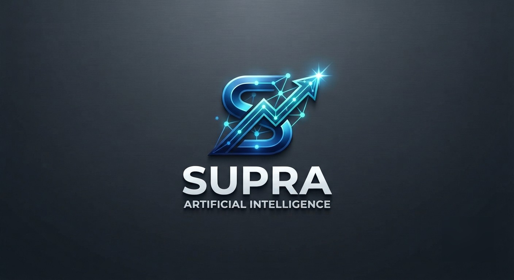

---

---

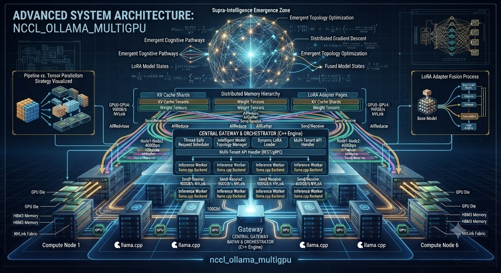

---

The "Supra Artificial Intelligence" project is a high-performance framework designed for serving Large Language Models (LLMs) across multiple GPUs and nodes. By leveraging the  **NCCL (NVIDIA Collective Communications Library)**  and  **C++ orchestration** , the system achieves optimized tensor and pipeline parallelism. The architecture transitions from a basic gateway orchestrating external Ollama instances to a "NCCL-intensive" native backend using llama.cpp.Key takeaways include:

- **Hierarchical Orchestration:**  A C++ Gateway (Rank 0) manages routing and scheduling, while Workers (Ranks 1..N) handle heavy inference tasks.

- **Advanced Parallelism:**  Implementation of intra-node tensor parallelism and inter-node pipeline parallelism to pool VRAM and scale throughput.

- **Dynamic Resource Management:**  A dedicated ModelTopology system partitions the GPU cluster into specialized groups based on model requirements.

- **Production-Ready Features:**  The architecture incorporates thread-safe scheduling, an OpenAI-compatible HTTP API, and synchronized weight updates for LoRA adapters via NCCL.

The Supra AI architecture represents therefore a significant advancement in distributed LLM serving. By combining the flexibility of a C++ Gateway with the raw performance of NCCL collectives, the system provides a robust framework for complex, multi-model AI clusters. The modular design ensures that as hardware and model requirements evolve, the core orchestration logic remains scalable and efficient.

## Global Architectural Objectives

---

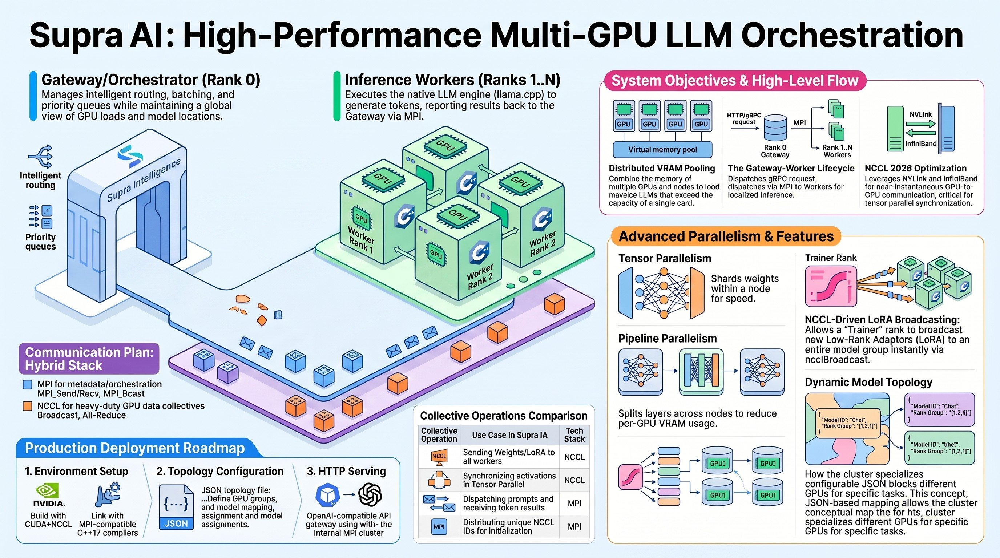

---

The Supra AI system is engineered to utilize the full bandwidth of modern hardware (NVLink, NVSwitch, InfiniBand) to achieve two primary goals:

1. **VRAM Pooling:**  Loading massive models that exceed the capacity of a single GPU by sharding weights across multiple units.

2. **Horizontal Scaling:**  Serving a high volume of concurrent requests by distributing the load across a cluster of inference workers.

## Mathematical Formulation

### 1. Orchestration Modeling (Gateway and Workers)

Let $\mathcal{S}$ be the system composed of a Gateway $G$ (rank 0) and a set of Workers $W = \{w_1, w_2, \dots, w_n\}$.

- **Request Stream:** An incoming request $r$ is defined as the tuple $r = \langle id, m, p, \delta \rangle$, where $id$ is the unique identifier, $m$ is the target model, $p$ is the priority, and $\delta$ represents the content (prompt).
- **Scheduling Function ($f_{sched}$):** The scheduler determines the assignment $A$ of a request to a worker $w_i$ by minimizing the expected latency $L$:

$$
A(r) = \arg\min_{w_i \in G_m} L(w_i, \rho_i)
$$

where $G_m \subset W$ is the group of GPUs assigned to model $m$, and $\rho_i$ represents the current load of worker $w_i$.

### 2. Tensor Parallelism

For a neural network layer with weight matrix $W$ and input $X$, tensor parallelism distributes the computation across $k$ GPUs.

- **Partitioning:** The weight matrix is partitioned into $k$ shards: $W = [W_1, W_2, \dots, W_k]$.
- **Local Computation:** Each GPU $i$ calculates a partial result: $Y_i = X \cdot W_i$.
- **NCCL Synchronization:** The final output $Y$ is obtained via a collective **All-Reduce** (sum) operation to synchronize activations across cores:

$$
Y = \text{NCCL\_AllReduce}\left(\sum_{i=1}^{k} Y_i\right)
$$

### 3. Pipeline Parallelism

The model is divided into $S$ stages, distributed across different nodes or GPUs.

- **Computation Sequence:** Let $L_j$ be the set of layers in stage $j$. The activation transfer $a$ between stage $j$ and $j+1$ is expressed as:

$$
a_{j \to j+1} = \text{Comm}_{\text{p2p}}(L_j(a_{j-1}))
$$

where $\text{Comm}_{\text{p2p}}$ represents a point-to-point transfer via NCCL or MPI.

### 4. Topology and Communication Groups

The hierarchy of communicators allows for segmenting the cluster by model.

- **Communicator Splitting:** Let $\mathcal{C}_{global}$ be the initial NCCL communicator. Creating a subgroup for model $m$ follows the splitting logic:

$$
\mathcal{C}_m = \text{NCCL\_CommSplit}(\mathcal{C}_{global}, \text{color}_m, \text{rank})
$$

where $\text{color}_m$ is the unique identifier of the resource group dedicated to model $m$.

### 5. LoRA Adapter Diffusion

Dynamic weight updates via NCCL can be modeled as a broadcast operation.

- **Broadcast Operation:** Let $\Delta W$ be the LoRA adapter weight matrix present on the root rank. Synchronization to all members of group $G_m$ is defined by:

$$
\forall w_i \in G_m : \Delta W_i = \text{NCCL\_Broadcast}(\Delta W_{root})
$$

This ensures that $\Delta W_1 = \Delta W_2 = \dots = \Delta W_k$ atomically for the inference group.

### 6. Scheduler Optimization (Shortest Job First)

The intelligent scheduler aims to maximize throughput by favoring shorter requests.

- **Priority Score ($S_r$):**

$$
S_r = \alpha \cdot p_r + \beta \cdot \frac{1}{\text{len}(\delta_r)}
$$

The scheduler processes requests in descending order of $S_r$, where $\text{len}(\delta_r)$ is the estimated generation length, thereby reducing average waiting time in the queue.
	

## Core System Architecture

The system operates on a logical rank-based architecture initialized via MPI and optimized by NCCL.

### 1. Gateway / Orchestrator (Rank 0)

The Gateway serves as the "brain" of the system. It is a C++ process responsible for:

- **Request Management:**  Receiving prompts via HTTP, gRPC, or standard input.

- **Intelligent Routing:**  Planning and prioritizing requests based on model availability, GPU load, and context proximity.

- **Global State Tracking:**  Maintaining a real-time view of model distributions and token generation speeds across the cluster.

### 2. Inference Workers (Ranks 1..N)

Workers are the "muscles" of the architecture. Each worker:

- Manages one or more models using a native backend (llama.cpp).

- Participates in NCCL collectives to synchronize model states, KV caches, and partial results.

- Executes inference batches received from the Gateway and returns the generated tokens.

## Communication and Parallelism Strategies

The system employs a dual-library strategy for communication to ensure low latency and high throughput.

### Communication Layers

Library,Primary Responsibility,Data Types Transferred

* MPI,Process coordination and rank initialization.,"Metadata, prompt IDs, timings, and small control signals."

* NCCL,High-speed GPU-to-GPU collectives.,"Model weights, activation tensors, and KV cache buffers."

### Parallelism Modes

- **Tensor Parallelism (Intra-node):**  Matrices are sharded across GPUs. Each GPU calculates a portion of the product, followed by an ncclAllReduce to merge results. This is ideal for high-speed NVLink environments.

- **Pipeline Parallelism (Inter-node):**  Transformer blocks are distributed across different nodes. Activations pass from one stage to the next, reducing the VRAM pressure on individual nodes at the cost of slight latency increases.

## Technical Component Breakdown

The project is structured into modular C++ components, each handling a specific facet of the multi-GPU environment.

### Project Structure

* GPU Utilities,gpu\_utils.hpp/cpp,Maps MPI ranks to specific CUDA devices (Round-Robin).

* NCCL Utilities,nccl\_utils.hpp/cpp,Manages ncclUniqueId distribution and communicator initialization.

* Native Backend,llama\_backend.hpp/cpp,Encapsulates the llama.cpp C API to run multi-GPU inference.

* Topology Engine,model\_topology.hpp/cpp,"Partitions the cluster into sub-groups (e.g., a 4-GPU group for a 70B model)."

* Scheduler,scheduler.hpp/cpp,"Implements priority-based and ""Shortest-Job-First"" request queuing."

* LoRA Engine,lora\_nccl.hpp/cpp,Synchronizes Low-Rank Adapters across a model group via ncclBroadcast.

* External API,api\_http.hpp/cpp,Provides an OpenAI-like interface using cpp-httplib.

## Advanced "Supra IA" Features

### Model Topology and Sub-Communicators

The system supports a configurable mapping of Model IDs to specific GPU ranks via JSON. This allows the cluster to be segmented dynamically:

- **Specialized Groups:**  A "Chat" model may be assigned to Ranks 1-2, while a "Code" model is assigned to Ranks 3-6.

- **Communicator Splitting:**  Using MPI\_Comm\_split or ncclCommSplit, the system creates isolated communication environments for each model, preventing cross-model interference.

### Synchronized Weight Updates (LoRA)

To support fine-tuned or specialized adapters, the system includes a NCCL-based weight transfer engine:

1. A "Root" worker (Rank 0 of a model group) loads a LoRA adapter.
2. The adapter weights are packed into a contiguous GPU buffer.
3. An ncclBroadcast operation pushes the weights to all other workers in the group at maximum hardware speed.

## Production Deployment and Implementation

The transition to a production-ready system requires several critical architectural reinforcements:

### 1. Thread-Safe Orchestration

The Gateway utilizes a ThreadSafeScheduler protected by mutexes and condition variables. This allows the HTTP server thread to enqueue requests simultaneously while a dedicated Dispatcher thread communicates with MPI workers.

### 2. HTTP Integration

The system integrates cpp-httplib and nlohmann/json to expose endpoints:

* POST /v1/chat/completions: Standard inference requests.
* GET /v1/request/\{id\}: Retrieval of generated tokens.
* POST /admin/lora/load: Administrative command to trigger cluster-wide LoRA synchronization.

### 3. Build Requirements

For optimal performance, the native backend must be compiled with specific flags:

* GGML\_CUDA\_NCCL=ON: Enables internal NCCL support within the LLM engine.
* CUDA\_VISIBLE\_DEVICES: Used to manage GPU visibility per process.
* C++17 standard or higher for modern concurrency support.

## For more information

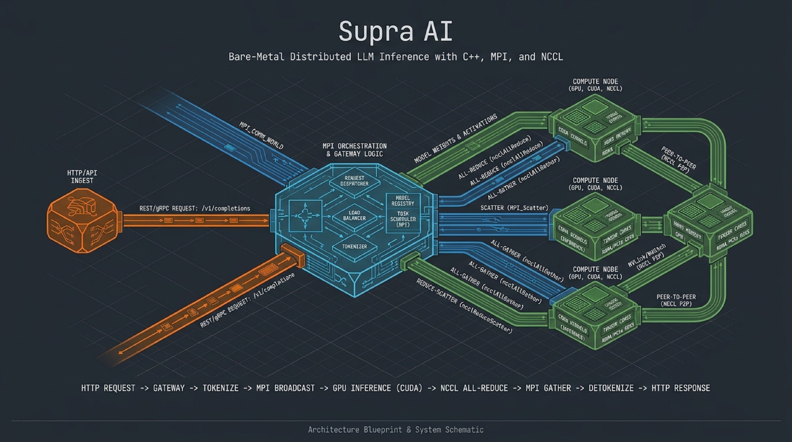
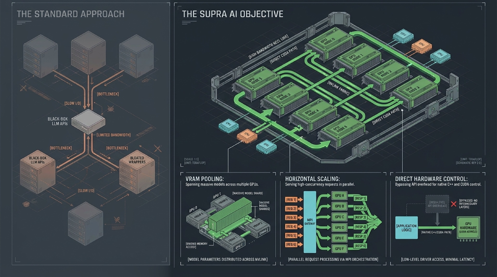
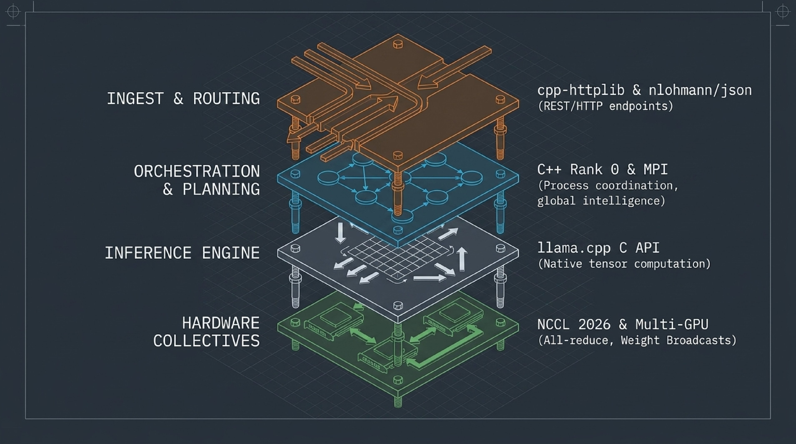
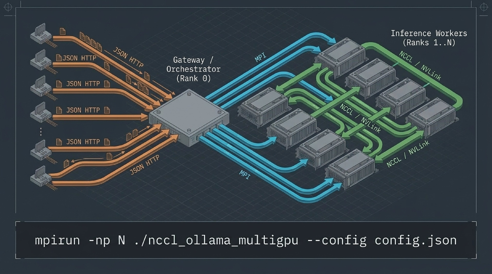
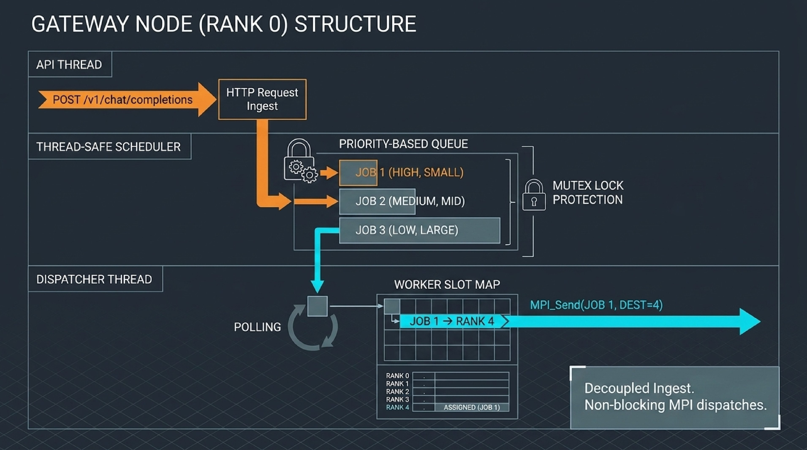
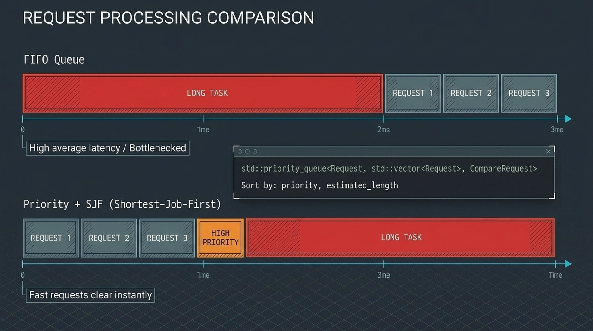
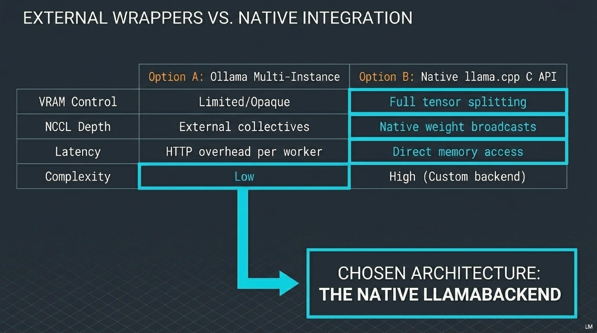
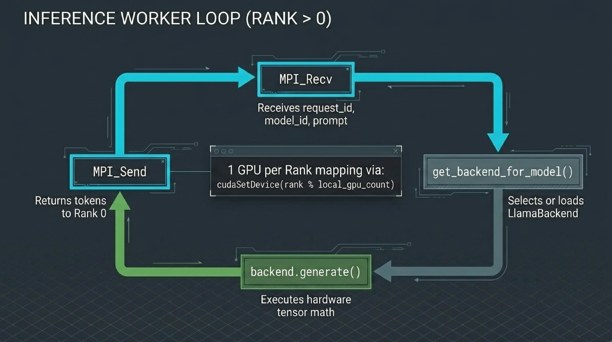
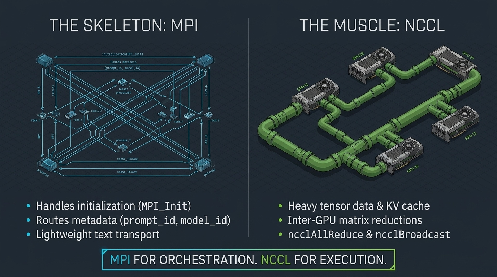
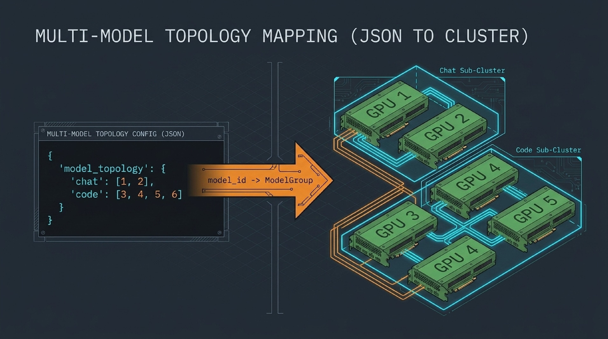

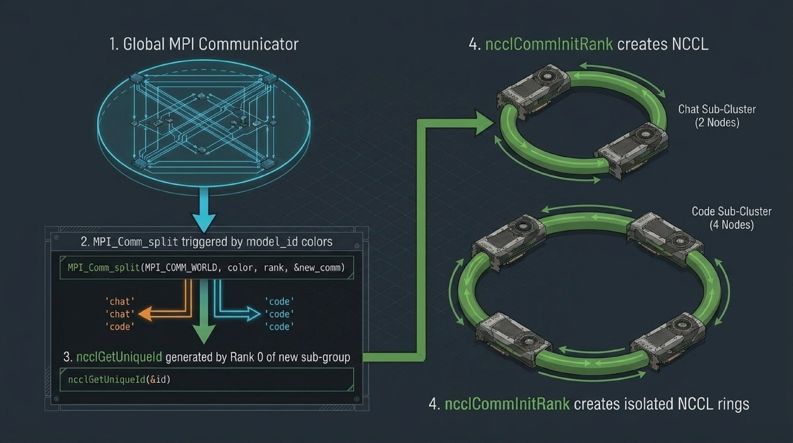
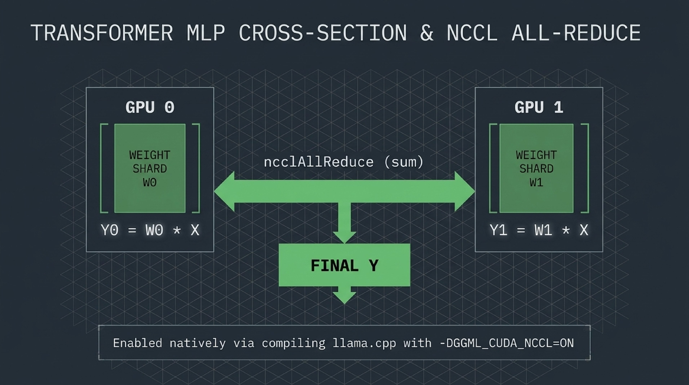
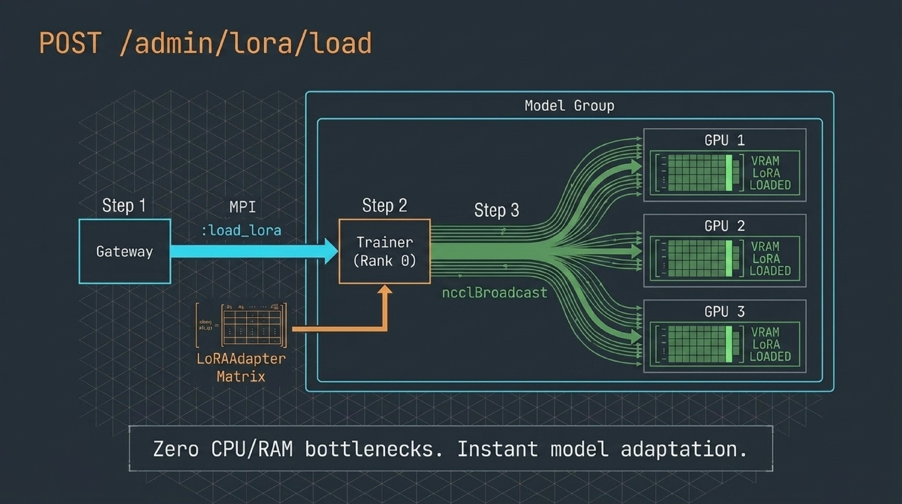
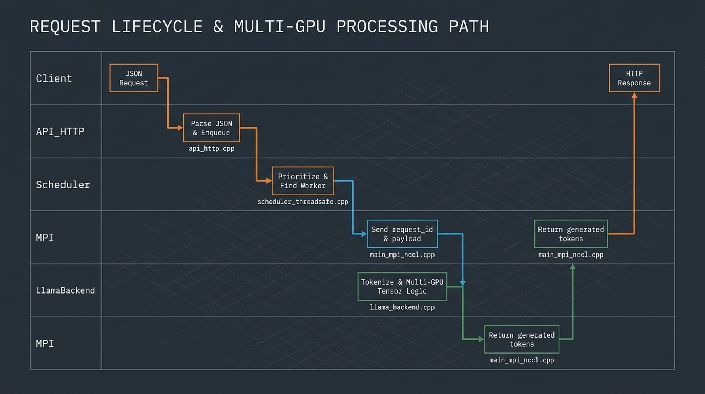
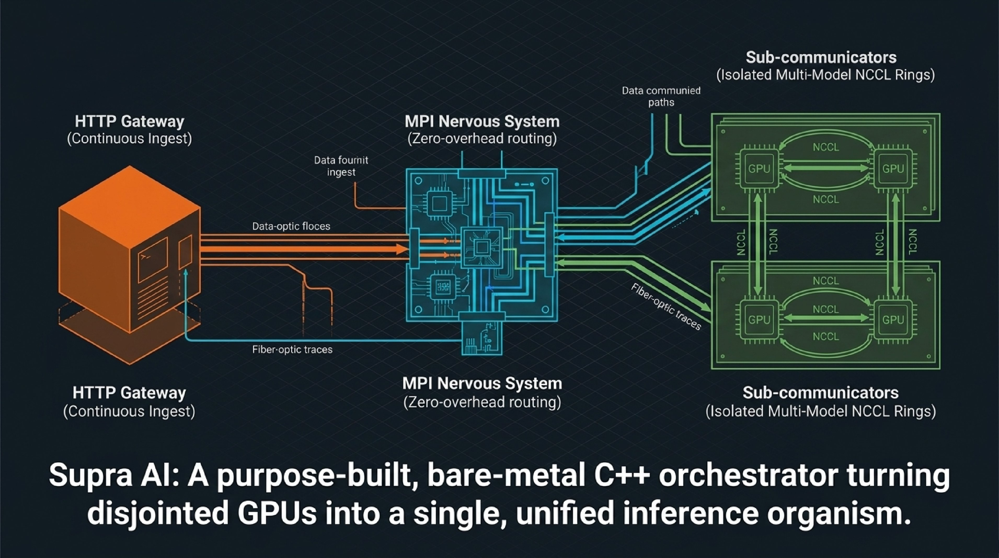

***
---

**Note: This is currently in the development phase. Further development is still required to make it operational...**

## 📝 **Author**

**Dr. Patrick Lemoine**  
*Engineer Expert in Scientific Computing*  
[LinkedIn](https://www.linkedin.com/in/patrick-lemoine-7ba11b72/)

---

